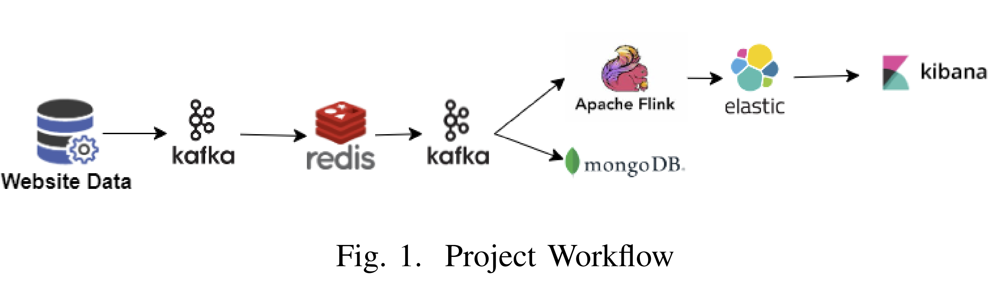
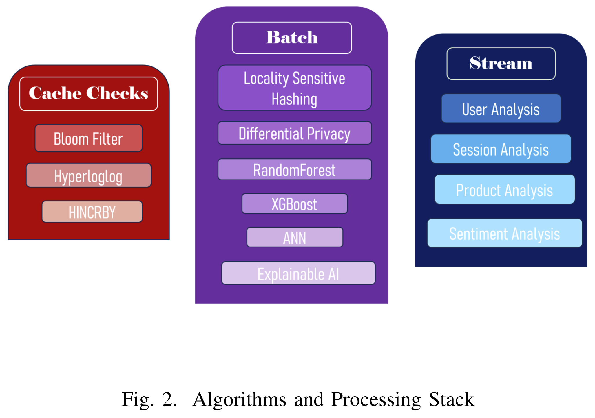

# 🛒 Real-Time + Offline Analytics for E-commerce

I built this project to explore how real-time data and offline machine learning can work together to improve user experience and drive smarter decision-making in e-commerce. A lot of solutions out there either focus on real-time metrics or deep offline modeling — I wanted to combine both in a single, functional pipeline.

The idea was to simulate a furniture e-commerce platform and build a system that could handle both fast, responsive analytics and deeper predictive insights.

## 🔧 How it works

I started by generating a synthetic dataset that includes user, session, and product data. Here's how the pipeline works:

- I used **Apache Kafka** to stream the session data  
- **Redis** checks for security flags and keeps track of unique users and session counts in real time  
- Data is then stored in **MongoDB** for offline batch analysis  
- I implemented **Locality Sensitive Hashing (LSH)** to find similar users based on their session behavior  
- To predict whether a user will make a purchase, I trained multiple models including **Random Forest**, **XGBoost**, and **Artificial Neural Networks**  
- I added **differential privacy** techniques to make sure sensitive user information stays protected  
- To interpret model predictions, I used **SHAP** for explainability  
- On the real-time side, I used **Apache Flink** to process clean user sessions and send the output to **Elasticsearch**  
- Finally, I built dashboards in **Kibana** to visualize user behavior, product performance, and overall activity

## 🧠 Why I built this

I wanted to better understand how businesses can use AI and data systems that combine real-time processing with strategic offline analysis. This project gave me the chance to work across the full stack — from data ingestion and stream processing to model building and visualization.

It also helped me explore tools like Kafka, Flink, Redis, and SHAP, while applying concepts like differential privacy and session-based recommendations in a practical way.

